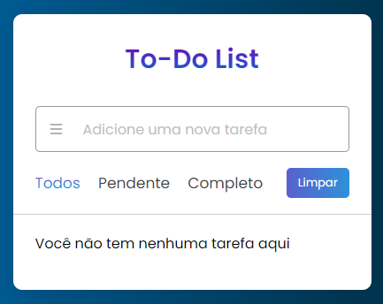

<h1 align="center">
  🎯 To-Do List
</h1>

  

<h4 align="center"><a href="https://helbamonteiro.github.io/To-Do-List">Clique para visitar o projeto</a></h4>

O objetivo desta ferramenta de lista de tarefas (To-Do List) é proporcionar uma maneira organizada e eficiente de gerenciar e acompanhar as atividades que precisam ser realizadas.

## Funcionalidades

1. **Adicionar Tarefas:** A capacidade de adicionar novas tarefas à lista.

2. **Marcação de Conclusão:** Um recurso para marcar tarefas como concluídas quando forem finalizadas.

3. **Visualização das tarefas:** Os usuários podem visualizar as tarefas que estão pendentes e as que já foram concluídas facilitando a organização.

4. **Simplicidade de Uso:**  Interface intuitiva e de fácil utilização para uma experiência do usuário eficiente.

## Tecnologias Utilizadas

- **HTML:** Utilizado para criar a estrutura básica da página web.
- **CSS:** Responsável pela estilização da interface, proporcionando uma experiência visual atraente e intuitiva.
- **JavaScript:** O JavaScript desempenha um papel fundamental na criação da lista de tarefas interativa, proporcionando a funcionalidade e dinamicidade necessárias para uma aplicação web eficiente e amigável.

## Como Usar

1. Abra o arquivo `index.html` em seu navegador.
2. Escreva na caixa "adicionar uma nova tarefa" e clique enter.

## Contribuições

Contribuições são bem-vindas! Sinta-se à vontade para abrir issues, propor melhorias ou enviar pull requests.

